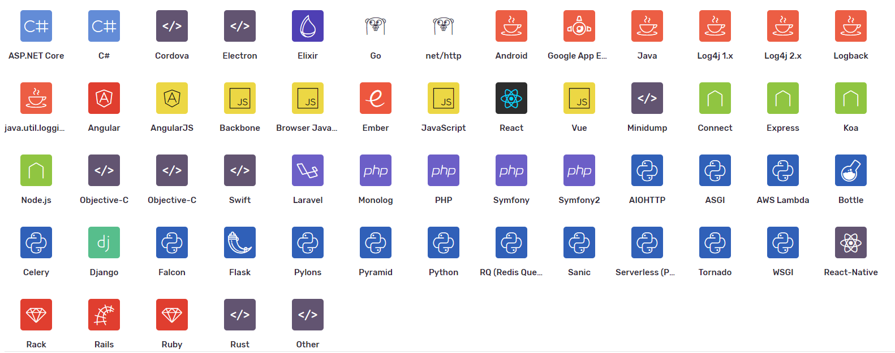

# **一、简介**

虽然我们有很多工具可以让开发工作变得更容易，但是发现和排查线上问题的过程仍然在很多时候让我们觉得很痛苦。当生产系统中产生了一个bug时，我们如何快速地得到报警？如何评估它的影响和紧迫性？如何快速地找到问题的根源？当hotfix完修复程序后，又如何知道它是否解决了问题？

Sentry在帮助我们与现有流程集成时回答了这些问题。例如，线上有一个bug，代码的某处逻辑的NullPointerException造成了这个问题，Sentry会立即发现错误，并通过邮件或其他基于通知规则的集成通知到相关责任人员，这个通知可以把我们引入到一个指示板，这个指示板为我们提供了快速分类问题所需的上下文，如：频率、用户影响、代码那一部分受到影响以及那个团队可能是问题的所有者。

Sentry是一个实时事件的日志聚合平台。


Sentry 本身是基于 Django 开发的，需要Postgresql、 Redis





那么Sentry是如何实现实时日志监控报警的呢？

首先，Sentry是一个C/S架构，分为服务端和客户端 。SDK我们需要在自己应用中集成Sentry的SDK才能在应用发生错误是将错误信息发送给Sentry服务端。根据语言和框架的不同，我们可以选择自动或自定义设置特殊的错误类型报告给Sentry服务端。

而Sentry的服务端分为web、cron、worker这几个部分，应用（客户端）发生错误后将错误信息上报给web，web处理后放入消息队列或Redis内存队列，worker从队列中消费数据进行处理。

# **二、部署**

## Kubernetes Helm Charts

https://github.com/helm/charts/tree/master/stable/sentry

```
`git clone https:``//github``.com``/helm/charts/tree/master/stable/sentry``cd` `sentry``helm ``install` `--namespace sentry --name sentry --wait -f values.yaml stable``/sentry`
```


## OpenShift 资源声明文件部署

[资源声明文件](https://github.com/RationalMonster/OKD/tree/master/MiddlewareOpenshiftTemplates/Sentry)


# **三、配置**


# 四、Kubernetes event 客户端


镜像GitHub：https://github.com/getsentry/sentry-docs/issues/1330


# 五、Java语言项目客户端配置


